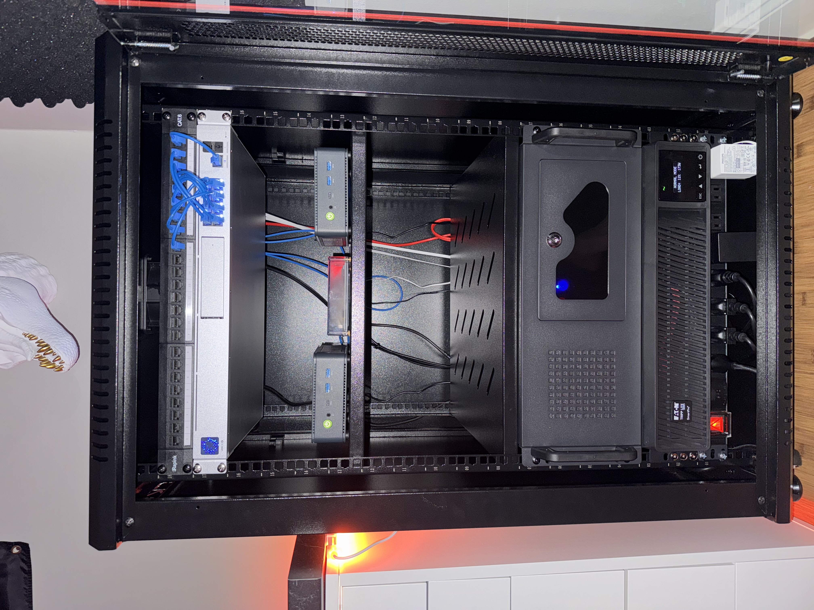

# Project Oswald (aka Homelab)

  

## Todo

### [Add List](https://github.com/stars/jonahgcarpenter/lists/homelab-todo)

### Problems:

- split GPU between multiple LXCs instead of using passthrough
- swap to bare metal k3s to remove virtualization overhead
- track helm chart versions with flux automations

## Hardware

### [UDM-SE](https://store.ui.com/us/en/category/all-cloud-gateways/products/udm-se)

- 2 PoE+
- 6 PoE
- 2.5GB WAN
- 2 SFP+
- [2x U7 Lite APs](https://store.ui.com/us/en/category/all-wifi/products/u7-lite)

### [PVE 1 & 2](https://www.gmktec.com/products/amd-ryzen-7-5825u-mini-pc-nucbox-m5-plus?srsltid=AfmBOorNrOPnRo3cqmPHBq14s82hdWG4dPwe6ntEimRl0J_gWKyXjpC3)

- Ryzen 7 5825U 8C/16T 4.5GHz
- 2x8GB 3200MHz DDR4
- 500GB NVMe
- Dual 2.5GB RJ45

### [PVE 3](https://pcpartpicker.com/user/HeyItsJonah/saved/bkgVD3)

- Ryzen 5 3600 6C/12T 3.6GHz
- 4x16GB 3200MHz DDR4
- 500GB NVMe
- 2x2TB 3.5" Drive
- RTX 3060 8GB VRAM
- Coral TPU USB

### [Home Assistant](https://www.home-assistant.io/yellow/)

- Compute Module 4
- 4GB Ram

### [Tripplite UPS](https://a.co/d/gjzwQbd)

- 1500VA
- 1440W
